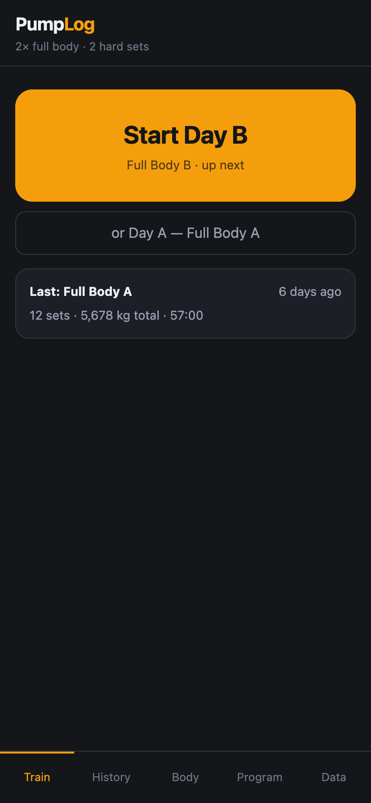
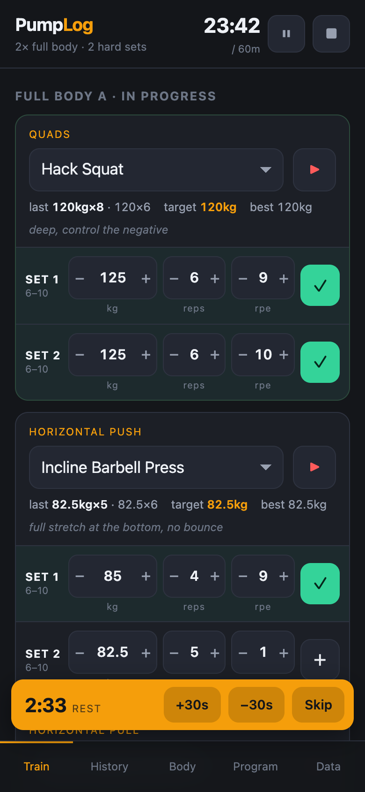
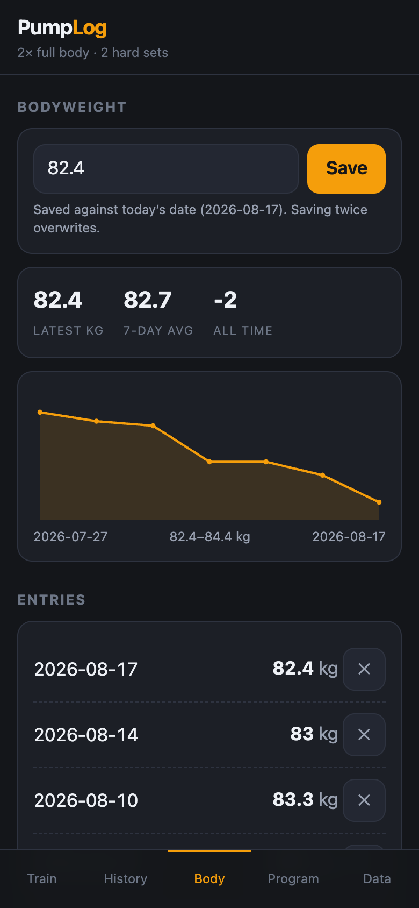

# Pump Log

A workout logger for **two full-body sessions a week** of low-volume, high-effort
training: **two straight working sets** per exercise — same weight, same rep range,
taken to about **1 rep in reserve** with full ROM and a controlled negative.
Roughly 12 hard sets per session — it fits in an hour.

Built for the phone: install it to your iPhone home screen, use it offline in the gym,
and your data never leaves the device.

| Train | Mid-session | Bodyweight |
| :-: | :-: | :-: |
|  |  |  |

## Why it's built this way

| Decision | Reason |
| --- | --- |
| Two sets per exercise | Intensity over volume: two straight sets at ~1 RIR beat five mediocre ones (a top-set + back-off structure is available per slot). |
| Full body A/B, not upper/lower | With only two sessions a week, a split would hit each muscle once. Full body trains everything twice. |
| Slots, not fixed exercises | Each slot ("Quads", "Vertical Pull") holds the variations you rotate between. Swap mid-session; history follows the *exercise*, so progression stays correct. |
| No account, no server | Works with no signal. Nothing to log into mid-set. |

## Using it

**Train** — one big button starts whichever day is up next. Log each set: weight, reps,
RPE (steppers, no typing needed). Tapping **+** stores the set and starts the rest timer.
A session clock runs against your 60-minute target and turns red when you go over; header
buttons **pause** the clock (rest timer freezes too) or **stop** and save the session.
Each exercise shows a short form cue and a **▶** button that opens YouTube form tutorials
for whatever variation is currently picked.

**Progression** is double progression: clear the top of the rep range and the app adds
that exercise's increment to your target next time, shown as `target 122.5kg ▲`. Each slot
also shows what you did last time and your best-ever top set.

**Body** — log bodyweight, see a trend line, 7-day average and all-time change.

**Program** — rename days, add/remove/reorder slots, edit rep ranges and increments,
choose straight vs rest-pause back-offs, and add your own exercises.

**Data** — settings for units, rest periods and session target, plus backup.

## Back up your data

Everything lives in this browser's local storage. Clear your Safari data and it's gone.
The **Data** tab exports a `.json` backup (download or clipboard) and restores from one.
Installing to the home screen makes storage considerably more durable than a browser tab.

## Install on iPhone

Open the site in Safari → **Share** → **Add to Home Screen**. It launches full-screen
and works with no connection.

## The default program

**Day A** — Quads · Horizontal Push · Horizontal Pull · Hamstrings · Side Delts · Triceps
**Day B** — Hinge · Vertical Pull · Vertical Push · Quads · Biceps · Calves

Defaults follow current evidence-based hypertrophy practice: machine/cable picks for
stability, stretch-position exercise selection (seated leg curl, overhead extensions,
incline curls), and lengthened-partial calves with a 3–5 s stretch hold. Every muscle
is hit twice a week at ~4 weekly sets — intentionally far below the point where extra
volume stops paying for its fatigue. No drop sets, giant sets, or finishers. Each
slot's second set can be straight, rest-pause (RP), or lengthened partials (LP), and
any slot can be switched to a classic **top set + back-off** structure in the Program
tab.

Every slot is editable; nothing here is load-bearing.

## Running locally

No build step, no dependencies.

```sh
python3 -m http.server 8000
# then open http://localhost:8000
```

A service worker caches the shell for offline use. It's network-first, so a deploy is
picked up as soon as there's signal — bump `CACHE` in `sw.js` when you change the code.

## Files

| File | Role |
| --- | --- |
| `index.html` | Shell: header, session clock, rest bar, tab bar |
| `app.js` | State, progression logic, all five views |
| `styles.css` | Dark theme, 46px touch targets, safe-area aware |
| `sw.js` | Offline cache |
| `manifest.webmanifest` | Home-screen install metadata |

## Licence

MIT — see [LICENSE](LICENSE).
